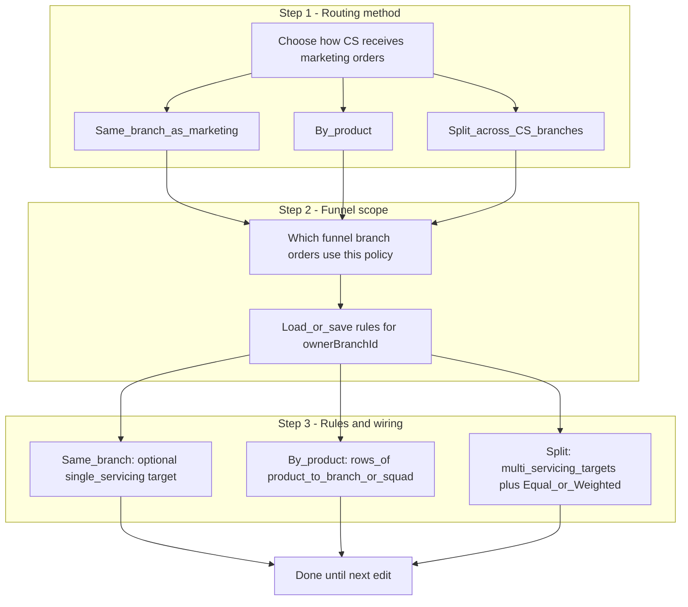

# CS order routing — UX plan (iterated)

## Intent

Ops think in terms of **what kind of routing rule** we are setting up **before** picking scope and branch pairs. The UI should lead with **routing method**, then **which funnel’s orders** this applies to, then **branch-to-branch (and product) wiring** only where that method needs it.

## Flow (diagram)

Branch-to-branch picking appears **inside step 3**, not before method selection.

## Step order (target UX)

1. **Routing method first** — Choose one:

- **Same branch as marketing** — servicing stays on the funnel branch unless you explicitly route elsewhere.
- **By product** — map each product to a servicing branch (and optional CS squad).
- **Split across CS branches** — share volume across multiple servicing branches (equal or weighted targets).

1. **Funnel branch (scope)** — **Which marketing branch’s inbound orders** does this configuration apply to?

- Same data as today: `ownerBranchId` / order attribution branch.
- **Why not step 1:** Psychologically users choose _how_ routing works first; scope second. Technically the app may still **require** this selection before loading existing rules from the API — show it immediately after method, or show method as step 1 with funnel branch as step 2 before any fetch.

1. **Rules / wiring** — Depends on method:

- **Same branch:** minimal — often default servicing = funnel branch; optional explicit targets.
- **By product:** product picker → servicing branch/squad per row.
- **Split:** multiple servicing branches + Equal vs Weighted; **branch-to-branch** choices live **here**, not before method.

## Backend constraint (no schema change assumed)

- `orders.getCsRoutingBranchSettings` / `listCsRoutingRules` require `**ownerBranchId`.
- **Implementation approach:** User selects **method** first (client state); **funnel branch** second → then loader/fetcher runs. Alternatively show both steps on one screen with method at top and funnel branch below, but **visual hierarchy** puts method first.

## Copy notes

- Step 1 title: **“How should CS receive orders from marketing?”** (not “relationship mode”).
- Step 2 title: **“Which funnel do these rules apply to?”** with hint: orders carry this branch for attribution.
- Step 3 title varies by method; branch-to-branch language appears in step 3 for split and product rows.

## Out of scope for this UX iteration

- Org-wide default method without per-funnel branch (would need product/API changes).

## Implementation todos (when executing)

- Reorder `[CsOrderRoutingSettingsPage.tsx](apps/web/app/features/settings/CsOrderRoutingSettingsPage.tsx)`: method selection visually first; funnel branch second; rules third.
- Preserve save semantics: relationship mode + rules still keyed by selected funnel branch.
- Optional: disable API-dependent panels until funnel branch is chosen after method is chosen.
