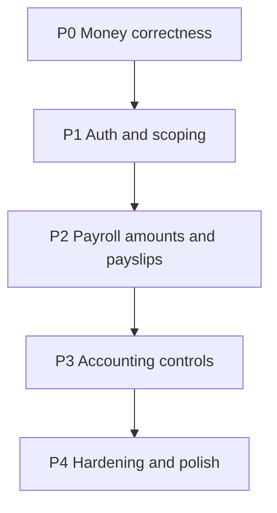

# Accounting + Payroll bugfix plan

**Date:** 2026-07-26  
**Status:** Implementation in progress (VAT model **A** approved: totalAmount VAT-inclusive).  
**Scope:** All issues from the Accounting / Payroll scan (Critical → Low).  
**Out of scope:** Dev-only sidebar pages (Assets, Aging, Tax, WHT, Budget) unless a fix touches shared GL services.

### Done in this pass
- P0.1 VAT-inclusive AR (+ COGS fail-closed, remittance zero/negative cash)
- P0.2–P0.3 cash `totalPayout` for bank export / payslip NET; penalty shown once on PDF
- P1.1–P1.4 Mark Paid = `finance.disburse` + branch scope; payslip/report company scope; bulkPayslipPdf auth
- P1.5 groupId locked for non–SuperAdmin; JE approve company check + no self-approve
- P2.2 override preserves deductions; P2.3 status WHERE races; P2.4 PAYE account fail-closed; P2.5 payout-line labels
- P3.1 opening balances one-shot; P3.2 draft idempotency unique; P3.3 threshold/self-approve; P3.6 Lagos dates on sales/remit/payroll/purchase

### Still open / light
- P2.1 full PAYE recompute on every adjustment type (partial via override path)
- P3.5 already covered with COGS fail-closed
- Broader Lagos date sweep on funding/expense paths
- Dedicated integration tests beyond VAT-inclusive sale case

---

## Goals

1. Money paths are correct: AR/VAT, remittance clear-down, payroll cash amount, GL liabilities.
2. Authorization is permission + company/branch scoped on mutations.
3. Idempotent / race-safe status and cutover posts.
4. Payslip / bank export numbers match what Finance pays.

---

## Workstreams (do in order)



---

## P0 — Money correctness (do first)

### P0.1 Sales VAT vs remittance AR mismatch — Critical

**Problem:** `postSalesInvoice` debits AR for `revenue + 7.5% VAT` when `2141` exists; `postRemittanceSettlement` credits AR only for `order.totalAmount`. Residual AR = VAT forever.

**Decision (recommended):** Treat `order.totalAmount` as **VAT-inclusive** cash receivable.

- Sale: `Dr AR = totalAmount`, `Cr Sales = totalAmount / 1.075`, `Cr VAT = totalAmount - sales` (when VAT account exists).
- If product pricing is confirmed VAT-exclusive instead, flip to: remittance credits AR for `totalAmount + VAT` (same total the sale debited). **Confirm with Finance once;** default to VAT-inclusive AR = invoice total (common COD model).

**Files:** `apps/api/src/finance/general-ledger.service.ts` (`postSalesInvoice`, `postRemittanceSettlement`), GL integration tests (seed with `2141` and assert AR nets to zero after remit).

**Accept:** Deliver → remit one order → AR net for that customer/order is 0; VAT Payable still shows until a separate VAT settlement (or document that VAT stays as liability until tax remittance JE).

---

### P0.2 Single cash field for payroll disbursement — High

**Problem:** Bank export / payslip prefer `netPay`; cash after deductions is `totalPayout`. Risk of overpaying.

**Decision:**

| Concept | Field | Use |
|---------|--------|-----|
| Taxable / after PAYE | `netPay` | Tax reports, label “Net before clawbacks” if shown |
| Cash to bank | `totalPayout` | Bank export, Mark Paid notifications, payslip **NET PAY**, Finance overview, GL accrued salaries |

**Files:** `payroll-batch.service.ts` (`exportBankUpload`, overview if needed), `payslip-mappers.ts`, `payslip-pdf.ts`, batch detail UI net column, `general-ledger.service.ts` `postPayrollBatch` (liability = sum `totalPayout` or batch `totalAmount`).

**Accept:** Add DEDUCTION adjustment → bank export amount = reduced `totalPayout`; payslip NET matches export.

---

### P0.3 Payslip penalty double-count — High

**Problem:** Formula nets return penalties into `grossPay`, but PDF also subtracts them via `deductionsTotal`.

**Decision:** Show penalties once under “Returns / penalties” in the gross build-up (or earnings section). Exclude penalty portion from “Other deductions” when already in gross. Printed NET must equal `gross − PAYE − non-penalty deductions` (= `totalPayout` after P0.2).

**Files:** `payroll-formula-engine.ts` / `payroll-compute.service.ts` (document fields), `payslip-pdf.ts`, preview mappers.

**Accept:** Staff with `returnedCount > 0` → Gross − PAYE − Other = printed NET.

---

## P1 — Auth and scoping

### P1.1 Mark Paid / finance reject permission — Critical

**Problem:** `canProcessBatch` uses `hasFinanceAccess` (AUDITOR, `finance.costView`, etc.).

**Decision:**

```ts
function canProcessBatch(user: SessionUser): boolean {
  if (user.role === 'SUPER_ADMIN' || user.role === 'SUPPORT') return true;
  return (user.permissions ?? []).includes('finance.disburse');
}
```

Keep `hasFinanceAccess` for bank-field visibility only. Wire `markBatchPaid` / finance reject to `permissionProcedure('finance.disburse')` where possible (plus SUPER_ADMIN/SUPPORT bypass already in middleware).

**Files:** `payroll-batch.service.ts`, `hr.router.ts`, UI button visibility.

**Accept:** AUDITOR / costView-only user cannot mark paid; Finance Officer with `finance.disburse` can.

---

### P1.2 Branch / company on batch mutations + detail — Critical

**Problem:** `markBatchPaid` / `getBatchDetail` ignore `effectiveBranchIds`.

**Decision:** Shared helper `assertBatchInScope(batch, viewer, effectiveBranchIds)` used by: getBatchDetail, submit, approve, reject, markPaid, exportBankUpload, getPayslip (staff self still allowed for own paid slips).

**Files:** `payroll-batch.service.ts`, `hr.router.ts` (pass `ctx.effectiveBranchIds`).

**Accept:** Finance on branch A cannot mark branch B batch paid.

---

### P1.3 Payslips / reports company scope — High

**Problem:** `listPayslips`, `payrollRegister`, cost/trend reports don’t take `effectiveBranchIds`.

**Decision:** Thread `effectiveBranchIds` like `listMonthlyPayrolls` / `getFinanceOverviewPayroll`.

**Files:** `payroll-batch.service.ts`, `hr.router.ts`.

---

### P1.4 bulkPayslipPdf IDOR — High

**Problem:** `payoutIds` path skips auth.

**Decision:** For each payout, call same auth as `getPayslip` (or filter to allowed set). Reject unauthorized IDs.

**Files:** `payroll-batch.service.ts` `bulkPayslipPdf`.

---

### P1.5 GL `groupId` override + ID mutations — High / Medium

**Problem:** `resolveGroupId(input.groupId ?? ctx.activeGroupId)` allows cross-company; approve/reverse/get by ID skip group check.

**Decision:**

- Non–SuperAdmin: force `ctx.activeGroupId` (ignore input `groupId`).
- SuperAdmin: allow override only when intentionally consolidating (keep existing consolidated report flags).
- On get/approve/reverse/updateAccount: assert `row.groupId === activeGroupId` (or SuperAdmin).

**Files:** `general-ledger.router.ts`, `general-ledger.service.ts`.

---

## P2 — Payroll tax / overrides / races

### P2.1 Adjustments / add-ons and PAYE — Medium

**Decision:** After BONUS/add-on/override that changes taxable gross, re-run `computePaye` on final taxable gross before persisting. Document CLAWBACK/DEDUCTION as post-tax cash reductions (no PAYE change).

**Files:** `payroll-batch.service.ts` (`recomputePayoutTotals`, `addBatchAdjustment`, `overridePayslipLine`), `payroll-compute.service.ts`.

---

### P2.2 overridePayslipLine preserves deductions — Medium

**Decision:** Override sets gross/tax/net inputs; `totalPayout = netPay - deductionsTotal` unless override explicitly clears deductions.

**Files:** `payroll-batch.service.ts`.

---

### P2.3 Status transition races — Medium

**Decision:** `UPDATE … WHERE id = ? AND status = 'EXPECTED'` + require returning row; else CONFLICT. Apply to submit / approve / reject / markPaid.

**Files:** `payroll-batch.service.ts`.

---

### P2.4 Payroll GL PAYE account missing — Medium

**Decision:** If `totalTax > 0` and PAYE account missing → `posted: false` with reason (don’t fold tax into accrued salaries). Alert via existing `runGlPostWithFinanceAlert`.

**Files:** `general-ledger.service.ts` `postPayrollBatch`.

---

### P2.5 Overview staffCount labeling — Low

**Decision:** Label “payout lines” or count distinct `staffId`. Prefer distinct staff for the card subtitle.

**Files:** `getFinanceOverviewPayroll`, `finance-overview-pulse.tsx`.

---

## P3 — Accounting controls

### P3.1 Opening balances one-shot — High

**Decision:** Server rejects second opening post per `groupId` if a JE already exists with voucher type / description marker `OPENING_BALANCE` (or dedicated flag). UI disable if already posted.

**Files:** `general-ledger.service.ts` `postOpeningBalances`, `OpeningBalancesPage.tsx`.

---

### P3.2 Draft JE idempotency_key collision — High

**Decision:** Stop storing draft line JSON in `idempotency_key`. Options:

1. **Preferred:** `draft_lines` jsonb column + migration + history sync.  
2. **Quick:** draft idempotency_key = `draft:${uuidv7()}` and store lines only in child table / temp payload column.

Prefer (1) if lines aren’t already in `gl_entries` for drafts; inspect current draft model and choose the smaller correct change.

**Files:** migration, schema, `createJournalEntry`, approve path that materializes lines.

---

### P3.3 Approval threshold effectiveness — High

**Decision:**

- Force draft when amount ≥ ₦500k for non–`SUPER_ADMIN`/`SUPPORT` only (remove ADMIN bypass if present).
- `approveJournalEntry`: reject if `approvedBy === createdBy` unless SuperAdmin/SUPPORT.
- Optionally require `finance.ledger.approve` permission (add to catalog if missing).

**Files:** `general-ledger.router.ts`, `general-ledger.service.ts`, journal list UI `canApprove`.

---

### P3.4 Remittance zero / negative cashBanked — Medium

**Decision:** Omit bank line when `cashBanked === 0` if other lines still balance; if `cashBanked < 0`, return `posted: false` with clear reason (don’t call `postVoucher` with negative debit).

**Files:** `general-ledger.service.ts` `postRemittanceSettlement`.

---

### P3.5 COGS silent drop — Medium

**Decision:** If `landedCost > 0` and COGS/stock accounts missing → entire sale post `posted: false` with reason (or post sale only when cogs === 0). Prefer fail-closed when cost exists.

**Files:** `postSalesInvoice`.

---

### P3.6 Posting dates in Africa/Lagos — Medium

**Decision:** Shared helper `businessCalendarDate(d: Date)` using Lagos TZ for sales, remittance, payroll, reverse. Replace `toISOString().slice(0, 10)` on those paths.

**Files:** `general-ledger.service.ts`, small util next to existing `nigeriaDayStart` if present.

---

## P4 — Tests and launch check

| Area | Tests to add/update |
|------|---------------------|
| VAT + remit | Deliver + remit with `2141` seeded → AR nets 0 |
| Opening | Second postOpeningBalances → error |
| JE approval | Creator cannot approve own draft; SuperAdmin can |
| Payroll mark paid | AUDITOR denied; wrong branch denied |
| Bank export | After deduction, amount = totalPayout |
| Payslip PDF | Penalty case NET identity |
| bulkPayslipPdf | Foreign payoutIds → FORBIDDEN |
| Status race | Optional unit: stale status update no-ops |
| Launch script | Fix payable code check `2121` (not `2205`); optional skip mutating steps via `DRY_RUN=1` later |

---

## Suggested implementation slices (PRs against `dev`)

| PR | Contents | Risk |
|----|----------|------|
| **PR1** | P0.1 VAT/AR + remittance tests | High money |
| **PR2** | P0.2 + P0.3 cash/payslip alignment | High money |
| **PR3** | P1.1–P1.4 payroll auth/scope/IDOR | Security |
| **PR4** | P1.5 + P3.1 + P3.3 + P3.4 + P3.5 accounting controls | Control |
| **PR5** | P3.2 draft lines + P2.* payroll races/PAYE/GL tax | Medium |
| **PR6** | P3.6 Lagos dates + P2.5 label + launch-check fix | Polish |

Do **not** combine PR1–PR3 into one mega-PR; each should be reviewable and releasable.

---

## Explicit non-goals (leave as intentional)

- Auto-post failures remain non-fatal with Finance alert (`runGlPostWithFinanceAlert`).
- Payroll GL does not clear bank on Mark Paid (accrual only) unless product later asks for payment voucher.
- Dev-only nav pages stay hidden on prod.
- Full IFRS cash flow statement / year-end closing entries.

---

## Acceptance checklist (end-to-end)

1. SuperAdmin: CoA → Opening (once) → JE → TB balances.  
2. Deliver + remit order: AR clears; VAT liability visible.  
3. Payroll: generate → HR approve → Finance mark paid (FO only) → bank export = payslip NET = batch cash.  
4. AUDITOR cannot mark paid.  
5. Company switcher: payslips/reports only show that company.  
6. Second opening balance post fails cleanly.  
7. FO creates ₦600k JE → cannot self-approve.

---

## Open product confirmation (one decision)

**VAT model:** Is `orders.totalAmount` VAT-inclusive or exclusive?

- **A (recommended default):** Inclusive → sale splits revenue/VAT inside AR = totalAmount.  
- **B:** Exclusive → remittance must credit AR for totalAmount + VAT.

Lock this before implementing P0.1.
